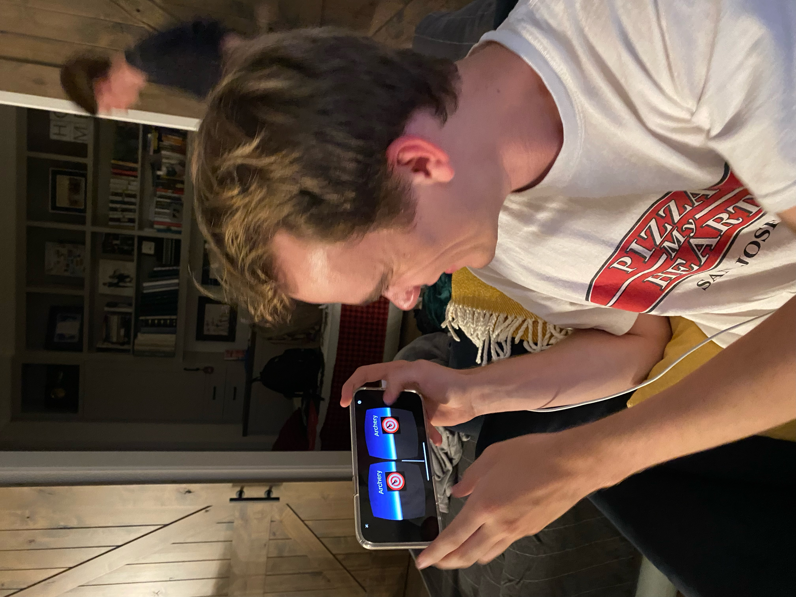

# COMP 790 A1 - Archery

I created an archery game for my Assignment 1 demo. The user is greeted by a target located 20 meters in front of them with "Archery" above it. Instead of using the target from the original project, I changed the image to a different target. The user can then tap the screen to shoot an arrow in the direction they are currently facing. A random vector is applied to the arrow to simulate wind and variance from the bow. If an arrow successfully hits the target, it stops and is stuck to the target for the rest of the game. However, if the arrow misses the target it continues to fall past the target. The arrows are represented by cylinders with a dark brown colored material applied to them.

This fits the definition of a game because there are rules defined by the physics of the game engine, there is a set goal to shoot the arrows as close to the center, and you could win or lose by playing against another player. There is also a score being calculated that you can check in the logs, which helps measure how close the arrows are to the target center.

